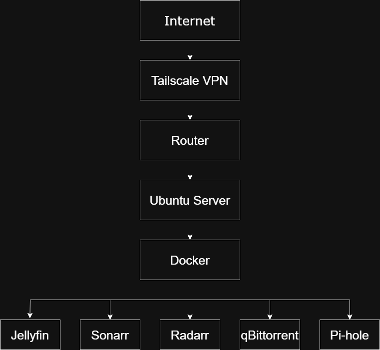
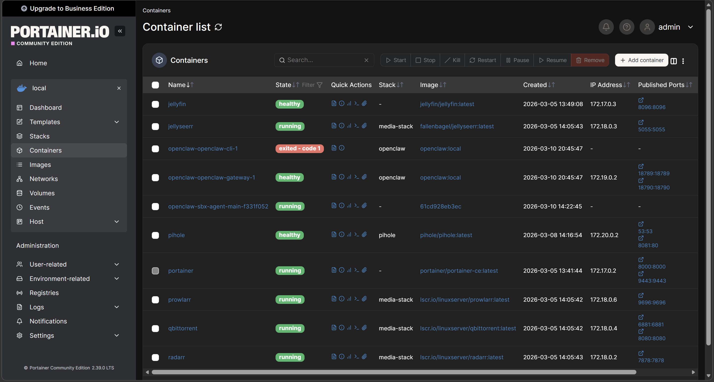
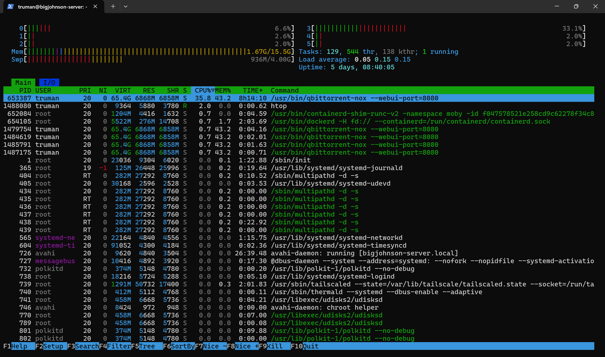
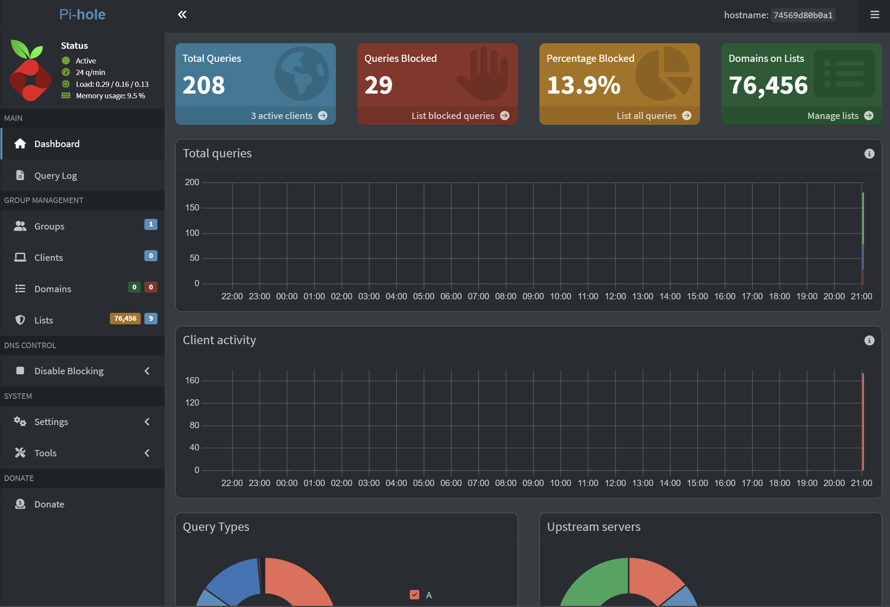
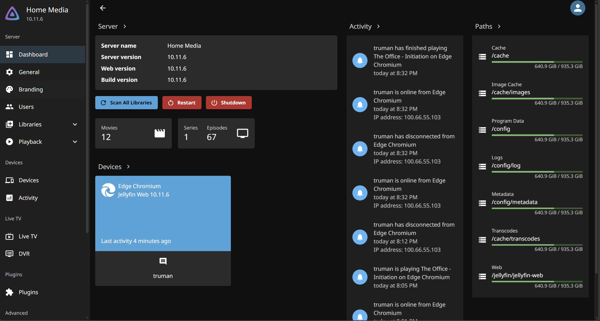

# home-server-infrastructure
Self-hosted Linux server for media streaming, automated file management, and network infrastructure using Docker, Jellyfin, Sonarr, Radarr, qBittorrent, Pi-hole, and Tailscale VPN.

## Overview

This project documents the design and deployment of a self-hosted Linux server used to manage media streaming, automated file organization, and home network infrastructure.

The system uses containerized services running through Docker to automate media downloads, organize files, stream content, and provide network-wide ad blocking. Secure remote access is implemented using Tailscale VPN.

The goal of this project was to gain hands-on experience with Linux systems, containerization, networking, and troubleshooting distributed services.

---

## System Architecture

Internet
   │
Tailscale VPN
   │
Ubuntu Server
   │
Docker
 ├── Jellyfin
 ├── Sonarr
 ├── Radarr
 ├── qBittorrent
 └── Pi-hole
 
---

## Technologies Used

- Ubuntu Linux
- Docker
- Jellyfin
- Sonarr
- Radarr
- qBittorrent
- Pi-hole
- Tailscale VPN

---

## Key Features

- Containerized services using Docker
- Automated media management using Sonarr and Radarr
- Local media streaming through Jellyfin
- Secure remote server access through Tailscale VPN
- Network-wide DNS ad blocking using Pi-hole

---

## Engineering Work

This project required configuring and maintaining multiple interconnected services on a Linux server.

Key tasks included:

- Installing and configuring Docker for containerized applications
- Deploying and managing multiple services in Docker containers
- Configuring automated media organization pipelines
- Implementing secure remote access using a VPN
- Configuring DNS filtering through Pi-hole
- Troubleshooting networking and container configuration issues

---

## Lessons Learned

This project provided practical experience with:

- Linux system administration
- containerized application deployment
- networking and DNS configuration
- troubleshooting distributed services

It also strengthened my understanding of how complex software systems interact within a larger infrastructure environment.

---

## Screenshots

### Architecture Diagram

### Docker Containers

### Server Terminal

### Pi-hole Dashboard

### Jellyfin Interface

